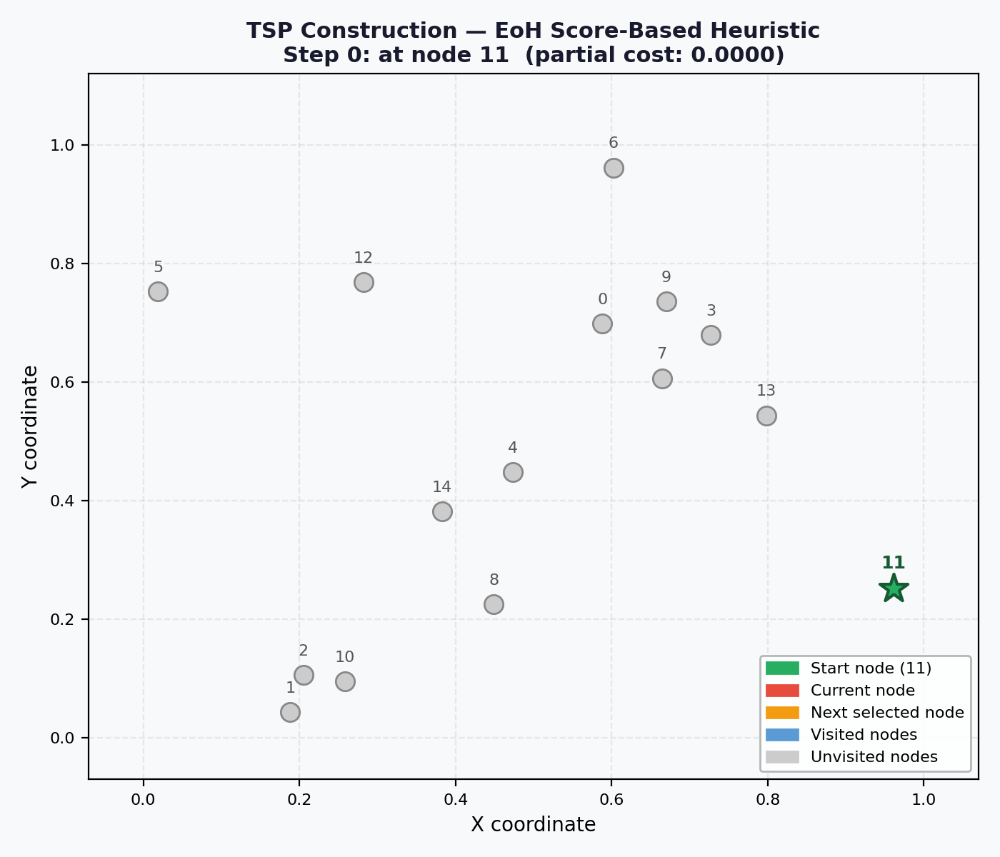
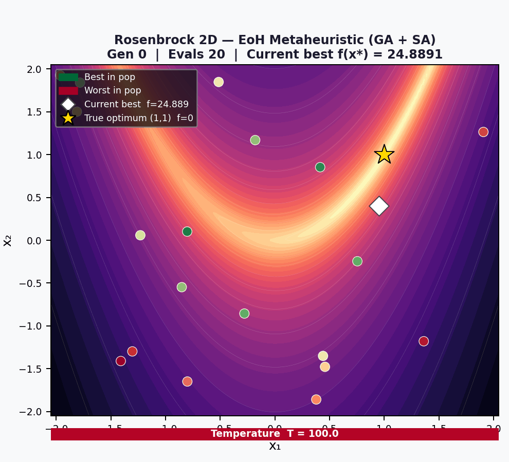
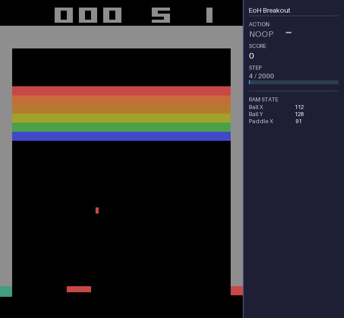

<div align=center>
<h1 align="center">
EoH: Evolution of Heuristics 
</h1>
<h3 align="center">
A Platform of Evolutionary Computation (EC) + Large Language Model (LLM) for Automatic Algorithm/Heuristic Design 
</h3>

[Chinese Version 中文版本](./README_CN.md)

[![Github][Github-image]][Github-url]
[![License][License-image]][License-url]
[![Releases][Releases-image]][Releases-url]
[![Wiki][Wiki-image]][Wiki-url]


[Github-image]: https://img.shields.io/badge/github-12100E.svg?style=flat-square
[License-image]: https://img.shields.io/badge/License-MIT-orange?style=flat-square
[Releases-image]: https://img.shields.io/badge/Release-Version_1.0-blue?style=flat-square
[Installation-image]: https://img.shields.io/badge/Web_Demo-Version_1.0-blue?style=flat-square
[Wiki-image]: https://img.shields.io/badge/Docs-参考文档-black?style=flat-square


[Github-url]: https://github.com/FeiLiu36/EOH
[License-url]: https://github.com/FeiLiu36/EOH/blob/main/LICENSE
[Releases-url]: https://github.com/FeiLiu36/EOH/releases
[Wiki-url]: https://github.com/FeiLiu36/EOH/tree/main/docs


</div>
<br>

A Lightweight and User-Friendly EoH Framework for LLM-driven Automated Algorithm/Heuristic Design

> [!Note]
> **Using the old EoH version?** If your code uses `Paras` / `eoh.EVOL`, it targets the legacy v0.1 interface.
> Download or install the old version from the [**v0.1 release**](https://github.com/FeiLiu36/EoH/releases/tag/v0.1):
> The current `main` branch uses the new `LLMConfig` / `EoH` / `BaseProblem` API documented below.


---
## News 🔥 
+ 2026.02 🎉🎉 **New Champion!** EoH won the [CVRPLib BKS competition](https://galgos.inf.puc-rio.br/cvrplib/index.php/en/bks_challenge/score/) and established **51 new Best Known Solutions** on large-scale CVRP benchmarks.
+ 2026.01 🎉🎉 Our Survey Paper ["A Systematic Survey on Large Language Models for Algorithm Design"](https://arxiv.org/pdf/2410.14716) has been accepted by [**ACM Computing Surveys**](https://dl.acm.org/journal/csur) ! A Rep for the Survey can be found [here](https://github.com/FeiLiu36/LLM4AlgorithmDesign)
+ 2025.06 🎉🎉 We're excited to share that **EoH** recently set a **New World Record in Circle Packing Problem**, achieving a score of 2.63594 for 26 circles !  [Results here](https://github.com/Optima-CityU/llm4ad/tree/main/example/circle_packing)
+ 2024.05, [EoH (Evolution of Heuristics: Towards Efficient Automatic Algorithm Design using Large Language Model)](https://arxiv.org/abs/2401.02051) has been accepted at **ICML 2024 (Oral, Top 1.5%)**! 🎉

---

## Introduction 📖

Heuristics are indispensable for tackling complex search and optimization problems. However, manual heuristic design is tedious and demands significant human intuition and experience. 

EOH introduces a novel paradigm that leverages the synergy between Large Language Models (LLMs) and Evolutionary Computation (EC) for Automatic Heuristic Design (AHD). The coevolution of thoughts and codes within an evolutionary framework offers superior AHD performance while mitigating computational expenses. 


EOH designs very competitive algorithms/heuristics in minutes/hours. Notably, it surpasses FunSearch, identifying superior heuristics with significantly fewer computational budgets (i.e., queries to LLMs) on online bin packing problem.

The following figure shows the evolution of EOH on the online bin packing problem. We outline the key **thoughts** and the corresponding **code snippets** that have contributed to the best results during evolution. Additionally, we mark the prompt strategies that result in improvement. Finally, we present the optimal heuristic in the final population and compare it to the heuristics designed by humans and from FunSearch.


If you find EoH helpful for your research or applied projects:

```bibtex
@inproceedings{fei2024eoh,
    title={Evolution of Heuristics: Towards Efficient Automatic Algorithm Design Using Large Language Model},
    author={Fei Liu, Xialiang Tong, Mingxuan Yuan, Xi Lin, Fu Luo, Zhenkun Wang, Zhichao Lu, Qingfu Zhang},
    booktitle={International Conference on Machine Learning (ICML)},
    year={2024},
    url={https://arxiv.org/abs/2401.02051}
}
```

If you are interested in LLM4Opt or EoH, you can:

1) Contact us through email fliu36-c@my.cityu.edu.hk.
2) Visit [a collection of references and research papers on LLM4Opt](https://github.com/FeiLiu36/LLM4Opt)
3) Join our QQ Group


   


If you encounter any difficulty using the code, you can contact us through the above or submit an [issue](https://github.com/FeiLiu36/EoH/issues)


## Requirements

- python >= 3.10
- numpy
- joblib


## EoH Example Usage 💻 

#### Step 1: Install EoH

We suggest installing and running EoH in a [conda](https://conda.io/projects/conda/en/latest/index.html) environment with python >= 3.10.

```bash
cd eoh
pip install .
```

#### Step 2: Configure your LLM and run an example

**<span style="color: red;">Set up your endpoint and key for a remote LLM, or configure a local LLM, before starting!</span>**

```python
from eoh import EoH, LLMConfig
from prob import MyProblem  # your problem class (see "Use EoH in Your Application" below)

llm = LLMConfig(
    api_endpoint="api.deepseek.com",  # e.g. "api.openai.com" or "api.deepseek.com"
    api_key="your-api-key",
    model="deepseek-chat",            # e.g. "gpt-4o", "deepseek-chat"
    timeout=150,
)

task = MyProblem(timeout=40, n_processes=4)

eoh = EoH(
    llm=llm,
    problem=task,
    pop_size=5,       # population size per generation
    n_pop=20,         # number of generations
    operators=['e1', 'e2', 'm1', 'm2'],
    output_dir="./results",
)
eoh.run()
```

###### Example 1: Constructive Algorithm for TSP

```bash
cd examples/tsp_construct
python runEoH.py
```
**Evaluation**
```bash
cd examples/tsp_construct/evaluation
# copy your heuristic to heuristic.py (function name/input/output must match the evaluation block)
python runEval.py
```

###### Example 2: Online Bin Packing
(**<span style="color: red;">Generate a new best heuristic in 30 minutes on your personal computer!</span>** i7-10700 2.9GHz, 32 GB)

```bash
cd examples/bp_online
python runEoH.py
```
**Evaluation**
```bash
cd examples/bp_online/evaluation
# copy your heuristic to heuristic.py (function name/input/output must match the evaluation block)
python runEval.py
```


## Use EoH in Your Application

Define your problem by subclassing `BaseProblem`. You need to provide:
- `template_program`: a Python function (or class) skeleton the LLM will evolve.
- `task_description`: a one-sentence description of what the LLM should optimise.
- `evaluate_program`: a method that receives the generated callable and returns a float fitness (lower is better), or `None` on failure.

```python
import numpy as np
from eoh import EoH, LLMConfig, BaseProblem


class MyProblem(BaseProblem):
    template_program = '''
def heuristic(x: np.ndarray) -> float:
    """Compute a score for input x."""
    return float(x.mean())
'''
    task_description = "Design a heuristic function that minimises the mean of the input."

    def evaluate_program(self, program_str: str, callable_func) -> float | None:
        # Replace with your actual evaluation logic
        score = callable_func(np.random.rand(10))
        return score  # lower is better


llm = LLMConfig(
    api_endpoint="api.deepseek.com",
    api_key="your-api-key",
    model="deepseek-chat",
)

task = MyProblem(timeout=30, n_processes=4)

eoh = EoH(llm=llm, problem=task, pop_size=5, n_pop=20, output_dir="./results")
eoh.run()
```

EoH supports three template kinds, detected automatically:
- **`function`** — a single function (most common).
- **`multi_function`** — multiple cooperating functions; the last one is the entry point.
- **`class`** — a class with a designated method; the class name is the entry point.

See [`examples/tsp_construct_class`](https://github.com/FeiLiu36/EOH/tree/main/examples/tsp_construct_class) and [`examples/tsp_construct_multifunction`](https://github.com/FeiLiu36/EOH/tree/main/examples/tsp_construct_multifunction) for class and multi-function examples.


## Three Levels of Heuristic Design

EoH supports three levels of heuristic design, offering increasing expressiveness. All three are illustrated using the TSP constructive heuristic task.

---

#### Level 1 — Single Function ([`tsp_construct`](https://github.com/FeiLiu36/EOH/tree/main/examples/tsp_construct))

The simplest and most common form. The LLM evolves a single standalone function. The entry point is the function itself.

```python
template_program = '''
def select_next_node(current_node: int, destination_node: int,
                     unvisited_nodes: np.ndarray,
                     distance_matrix: np.ndarray) -> int:
    """Select the next node to visit in a TSP greedy construction."""
    return unvisited_nodes[np.argmin(distance_matrix[current_node][unvisited_nodes])]
'''
```

---

#### Level 2 — Multi-Function ([`tsp_construct_multifunction`](https://github.com/FeiLiu36/EOH/tree/main/examples/tsp_construct_multifunction))

The LLM evolves multiple cooperating functions. The **last** top-level function is the entry point; helper functions defined above it are called internally. This allows the LLM to decompose the heuristic into reusable sub-components.

```python
template_program = '''
def compute_node_scores(current_node: int, unvisited_nodes: np.ndarray,
                        distance_matrix: np.ndarray,
                        destination_node: int) -> np.ndarray:
    """Compute a priority score for each candidate unvisited node."""
    return -distance_matrix[current_node][unvisited_nodes]


def select_next_node(current_node: int, destination_node: int,
                     unvisited_nodes: np.ndarray,
                     distance_matrix: np.ndarray) -> int:
    """Select the next node using compute_node_scores."""
    scores = compute_node_scores(current_node, unvisited_nodes,
                                 distance_matrix, destination_node)
    return unvisited_nodes[np.argmax(scores)]
'''
```

---

#### Level 3 — Class ([`tsp_construct_class`](https://github.com/FeiLiu36/EOH/tree/main/examples/tsp_construct_class))

The LLM evolves an entire class. The **class name** is the entry point — EoH instantiates it and calls the designated method. This is the most expressive level, enabling stateful heuristics, internal data structures, and object-oriented design.

```python
template_program = '''
class TSPConstructor:
    """Constructive heuristic for the Travelling Salesman Problem."""

    def select_next_node(self, current_node: int, destination_node: int,
                         unvisited_nodes: np.ndarray,
                         distance_matrix: np.ndarray) -> int:
        """Select the next node to visit."""
        return unvisited_nodes[np.argmin(distance_matrix[current_node][unvisited_nodes])]
'''
```

---

| | Single Function | Multi-Function | Class |
|---|:---:|:---:|:---:|
| **Entry point** | the function | last top-level function | the class (instantiated) |
| **Helper components** | — | additional functions above | methods and attributes |
| **Stateful design** | — | — | yes |
| **Typical use** | most heuristics | decomposed scoring/selection | stateful or complex heuristics |
| **Example** | `tsp_construct` | `tsp_construct_multifunction` | `tsp_construct_class` |


## Examples

The table below lists all 33 example tasks included in the `examples/` directory.

| TSP Constructive Heuristic | BBOB Metaheuristic | Atari Breakout |
|:---:|:---:|:---:|
|  |  |  |
| `tsp_construct` | `bbob_metaheuristic` | `ale_breakout` |

| Name | Description | Link | Note |
|------|-------------|------|------|
| `aco_pheromone` | Design a pheromone update rule for Ant Colony Optimization on TSP. | [code](https://github.com/FeiLiu36/EOH/tree/main/examples/aco_pheromone) | |
| `admissible_set` | Design a priority function for greedy construction of maximum-cardinality symmetric admissible sets. | [code](https://github.com/FeiLiu36/EOH/tree/main/examples/admissible_set) | |
| `ale_breakout` | Evolve an action-selection heuristic for an Atari Breakout agent. | [code](https://github.com/FeiLiu36/EOH/tree/main/examples/ale_breakout) | Requires ALE |
| `ale_pong` | Evolve an action-selection heuristic for an Atari Pong agent. | [code](https://github.com/FeiLiu36/EOH/tree/main/examples/ale_pong) | Requires ALE |
| `bbob_metaheuristic` | Design a complete single-objective metaheuristic for continuous black-box optimization. | [code](https://github.com/FeiLiu36/EOH/tree/main/examples/bbob_metaheuristic) | Class template |
| `bo_acquisition` | Design an acquisition function for Bayesian Optimization to guide candidate selection. | [code](https://github.com/FeiLiu36/EOH/tree/main/examples/bo_acquisition) | [PPSN 2024 Best Paper Nomination](https://arxiv.org/abs/2404.16906) |
| `bp_online` | Design a bin-scoring function for online bin packing to minimise the number of used bins. | [code](https://github.com/FeiLiu36/EOH/tree/main/examples/bp_online) | EoH paper benchmark |
| `cmaes_cov_update` | Design a covariance matrix update rule for CMA-ES on 10-D benchmarks. | [code](https://github.com/FeiLiu36/EOH/tree/main/examples/cmaes_cov_update) | |
| `cvrp_construct` | Design a greedy constructive heuristic for the Capacitated Vehicle Routing Problem. | [code](https://github.com/FeiLiu36/EOH/tree/main/examples/cvrp_construct) | |
| `de_crossover_100d` | Design an adaptive crossover operator for Differential Evolution at 100 dimensions. | [code](https://github.com/FeiLiu36/EOH/tree/main/examples/de_crossover_100d) | High-dimensional |
| `de_mutation` | Design a novel mutation operator for Differential Evolution on 10-D benchmarks. | [code](https://github.com/FeiLiu36/EOH/tree/main/examples/de_mutation) | |
| `deap_eaSimple_selection` | Design a parent selection operator for a DEAP genetic algorithm on 10-D benchmarks. | [code](https://github.com/FeiLiu36/EOH/tree/main/examples/deap_eaSimple_selection) | Uses DEAP |
| `es_step_size` | Design a step-size adaptation rule for (1+λ)-Evolution Strategy. | [code](https://github.com/FeiLiu36/EOH/tree/main/examples/es_step_size) | |
| `evo_dynamic` | Design a population response strategy for dynamic optimization under periodic environment changes. | [code](https://github.com/FeiLiu36/EOH/tree/main/examples/evo_dynamic) | Dynamic environment |
| `fssp_gls` | Design a guided local search perturbation for flow-shop scheduling to minimise makespan. | [code](https://github.com/FeiLiu36/EOH/tree/main/examples/fssp_gls) | |
| `gnn_aggregation` | Design a neighborhood aggregation function for GNN node classification. | [code](https://github.com/FeiLiu36/EOH/tree/main/examples/gnn_aggregation) | Requires PyTorch |
| `large_scale_es` | Design diagonal variance adaptation for separable CMA-ES at 100 dimensions. | [code](https://github.com/FeiLiu36/EOH/tree/main/examples/large_scale_es) | High-dimensional |
| `mobbob_metaheuristic` | Design a multi-objective metaheuristic to maximise hypervolume on 2-objective BBOB. | [code](https://github.com/FeiLiu36/EOH/tree/main/examples/mobbob_metaheuristic) | Multi-objective; class template |
| `moead_decomposition` | Design a decomposition function for MOEA/D to convert multi-objective problems into scalar subproblems. | [code](https://github.com/FeiLiu36/EOH/tree/main/examples/moead_decomposition) | Multi-objective |
| `nsga2_crowding` | Design a crowding-distance metric for NSGA-II to maximise hypervolume on ZDT problems. | [code](https://github.com/FeiLiu36/EOH/tree/main/examples/nsga2_crowding) | Multi-objective |
| `nsga2_pymoo` | Design a crossover operator for NSGA-II via pymoo on ZDT problems. | [code](https://github.com/FeiLiu36/EOH/tree/main/examples/nsga2_pymoo) | Multi-objective; uses pymoo |
| `nurse_rostering` | Design a shift-assignment priority function for nurse rostering to balance workload and preferences. | [code](https://github.com/FeiLiu36/EOH/tree/main/examples/nurse_rostering) | |
| `one_plus_one` | Design a mutation noise generator for nevergrad's (1+1)-ES on 10-D benchmarks. | [code](https://github.com/FeiLiu36/EOH/tree/main/examples/one_plus_one) | Uses nevergrad |
| `portfolio_construct` | Design an asset scoring function for greedy portfolio construction to maximise Sharpe ratio. | [code](https://github.com/FeiLiu36/EOH/tree/main/examples/portfolio_construct) | |
| `pso_velocity` | Design a velocity update rule for Particle Swarm Optimization on 10-D benchmarks. | [code](https://github.com/FeiLiu36/EOH/tree/main/examples/pso_velocity) | |
| `sa_acceptance` | Design an acceptance probability function for Simulated Annealing on 10-D benchmarks. | [code](https://github.com/FeiLiu36/EOH/tree/main/examples/sa_acceptance) | |
| `tabu_tsp` | Design a move-scoring function for Tabu Search with 2-opt moves on TSP. | [code](https://github.com/FeiLiu36/EOH/tree/main/examples/tabu_tsp) | |
| `tpe_bandwidth` | Design an observation-weighting function for Optuna's Tree-structured Parzen Estimator. | [code](https://github.com/FeiLiu36/EOH/tree/main/examples/tpe_bandwidth) | Uses Optuna |
| `tsp_construct` | Design a next-node selection heuristic for greedy TSP tour construction. | [code](https://github.com/FeiLiu36/EOH/tree/main/examples/tsp_construct) | EoH paper benchmark |
| `tsp_construct_class` | Design a TSP constructive heuristic as a class with a `select_next_node` method. | [code](https://github.com/FeiLiu36/EOH/tree/main/examples/tsp_construct_class) | Class template example |
| `tsp_construct_multifunction` | Design two cooperating functions (node scoring + selection) for TSP construction. | [code](https://github.com/FeiLiu36/EOH/tree/main/examples/tsp_construct_multifunction) | Multi-function template example |
| `tsp_gls` | Design an edge-distance update strategy for TSP Guided Local Search. | [code](https://github.com/FeiLiu36/EOH/tree/main/examples/tsp_gls) | |
| `tsp_rnr` | Design a destroy operator (node selection) for a ruin-and-recreate TSP algorithm. | [code](https://github.com/FeiLiu36/EOH/tree/main/examples/tsp_rnr) | |


## LLMs 

#### 1) Remote LLM via API (Recommended)

Set `api_endpoint`, `api_key`, and `model` in `LLMConfig`. Any OpenAI-compatible endpoint works:

```python
llm = LLMConfig(
    api_endpoint="api.openai.com",   # or "api.deepseek.com", etc.
    api_key="your-api-key",
    model="gpt-4o",
    timeout=150,
)
```

Supported providers include:
- [OpenAI API](https://platform.openai.com/)
- [DeepSeek API](https://platform.deepseek.com/)
- Any other OpenAI-compatible endpoint

#### 2) Local LLM

Set `use_local=True` and point `local_url` to your running inference server:

```python
llm = LLMConfig(
    use_local=True,
    local_url="http://127.0.0.1:11012/completions",
    timeout=180,
)
```

The local server must accept POST requests in the format expected by `api_local_llm.py`. Any server that serves a Hugging Face model (e.g., via a simple Flask/FastAPI wrapper) and returns `{"content": ["<generated text>"]}` will work.

#### 3) Custom Implementation

Subclass the LLM interface in `eoh/src/eoh/llm/` to integrate any other LLM provider.


## Frequently Asked Questions

For answers to common questions about installation, LLM configuration, defining problems, evolutionary operators, results, and troubleshooting, see the **[FAQ](./FAQ.md)**.

---

## Related Works on LLM4Opt
Welcome to visit [a collection of references and research papers on LLM4Opt](https://github.com/FeiLiu36/LLM4Opt)


## Contributors
 [Fei Liu](https://github.com/FeiLiu36) 
 [Rui Zhang](https://github.com/RayZhhh) 
 [Zhiyuan Yang](https://github.com/yzy1996) 
 [Ping Guo](https://github.com/pgg3)  
 [Shunyu Yao](https://github.com/ShunyuYao6)
