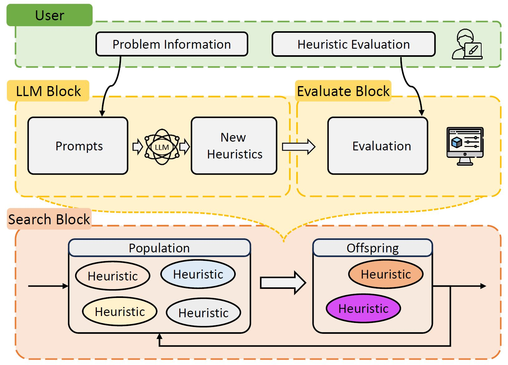

<div align=center>
<h1 align="center">
EoH: Evolution of Heuristics 
</h1>
<h3 align="center">
A Platform of Evolutionary Computation (EC) + Large Language Model (LLM) for Efficient Automatic Algorithm Design 
</h3>

[Chinese Version 中文版本](./README_CN.md)

[![Github][Github-image]][Github-url]
[![License][License-image]][License-url]
[![Releases][Releases-image]][Releases-url]
[![Wiki][Wiki-image]][Wiki-url]


[Github-image]: https://img.shields.io/badge/github-12100E.svg?style=flat-square
[License-image]: https://img.shields.io/badge/License-MIT-orange?style=flat-square
[Releases-image]: https://img.shields.io/badge/Release-Version_1.0-blue?style=flat-square
[Installation-image]: https://img.shields.io/badge/Web_Demo-Version_1.0-blue?style=flat-square
[Wiki-image]: https://img.shields.io/badge/Docs-参考文档-black?style=flat-square


[Github-url]: https://github.com/FeiLiu36/EOH
[License-url]: https://github.com/FeiLiu36/EOH/blob/main/LICENSE
[Releases-url]: https://github.com/FeiLiu36/EOH/releases
[Wiki-url]: https://github.com/FeiLiu36/EOH/tree/main/docs


</div>
<br>

> [!Important]
> This Rep will be maintained at a low frequency. Please visit our latest general-purpose Platform [LLM4AD](https://github.com/Optima-CityU/llm4ad)!
> 
> LLM4AD has a modulized framework with diverse methods (EoH, FunSearch, etc) and tasks (Optimization, Machine learning, etc).

A Platform for **Evolutionary Computation** + **Large Language Model** for automatic algorithm design.


---
## News 🔥 
+ 2024.10.30, Survey Paper [A Systematic Survey on Large Language Models for Algorithm Design](https://arxiv.org/pdf/2410.14716) has been uploaded to Arxiv ! 🎉
+ 2024.5.31, [Evolve Cost-aware Acquisition Functions Using Large Language Models](https://arxiv.org/abs/2404.16906) has been accepted at **PPSN 2024 (Best Paper Nomination)** ! 🎉
+ 2024.5.31, [Understanding the Importance of Evolutionary Search in Automated Heuristic Design with Large Language Models](https://arxiv.org/pdf/2407.10873) has been accepted at **PPSN 2024**! 🎉
+ 2024.5.5, [L-AutoDA: Leveraging Large Language Models for Automated Decision-based Adversarial Attacks](https://arxiv.org/abs/2401.15335) has been accepted at **GECCO 2024**! 🎉
+ 2024.5.2, [EoH (Evolution of Heuristics: Towards Efficient Automatic Algorithm Design using Large Language Model)](https://arxiv.org/abs/2401.02051) has been accepted at **ICML 2024 (Oral, Top 1.5%)**! 🎉

---

## Introduction 📖


Heuristics are indispensable for tackling complex search and optimization problems. However, manual heuristic design is tedious and demands significant human intuition and experience. 

EOH introduces a novel paradigm that leverages the synergy between Large Language Models (LLMs) and Evolutionary Computation (EC) for Automatic Heuristic Design (AHD). The coevolution of thoughts and codes within an evolutionary framework offers superior AHD performance while mitigating computational expenses. 




EOH designs very competetive algorithms/heuristics in minutes/hours.  Notably, It surpasses FunSearch, identifying superior heuristics with significantly fewer computational budgets (i.e., queries to LLMs) on online bin packing problem.

The following Figure shows the Evolution of EOH on the online bin packing problem. We outline the key **thoughts** and the corresponding **code** **snippets** that have contributed to the best results during evolution. Additionally, we mark the prompt strategies that result in improvement. Finally, we present the optimal heuristic in the final population and compare it to the heuristics designed by humans and from FunSearch.


If you find EoH helpful for your research or applied projects:

```bibtex
@inproceedings{fei2024eoh,
    title={Evolution of Heuristics: Towards Efficient Automatic Algorithm Design Using Large Language Model},
    author={Fei Liu, Xialiang Tong, Mingxuan Yuan, Xi Lin, Fu Luo, Zhenkun Wang, Zhichao Lu, Qingfu Zhang},
    booktitle={International Conference on Machine Learning (ICML)},
    year={2024},
    url={https://arxiv.org/abs/2401.02051}
}
```

If you are interested on LLM4Opt or EoH, you can:

1) Contact us through email fliu36-c@my.cityu.edu.hk.
2) Visit [a collection of references and research papers on LLM4Opt](https://github.com/FeiLiu36/LLM4Opt)
3) Join our Group (coming soon)

If you encounter any difficulty using the code, you can contact us through the above or submit an [issue](https://github.com/FeiLiu36/EoH/issues)


## Requirements

- python >= 3.10
- numba
- numpy
- joblib


## EoH Example Usage 💻 

#### Step 1: Install EoH

We suggest install and run EoH in [conda](https://conda.io/projects/conda/en/latest/index.html) env with python>=3.10

```bash
cd eoh

pip install .
```

#### Step 2: Try Example: 

**<span style="color: red;">Setup your Endpoint and Key for remote LLM or Setup your local LLM before start !</span>** 

For example, set the llm_api_endpoint to "api.deepseek.com", set llm_api_key to "your key", and set llm_model to "deepseek-chat".

```python
from eoh import eoh
from eoh.utils.getParas import Paras

# Parameter initilization #
paras = Paras() 

# Set parameters #
paras.set_paras(method = "eoh",    # ['ael','eoh']
                problem = "bp_online", #['tsp_construct','bp_online']
                llm_api_endpoint = "xxx", # set your LLM endpoint
                llm_api_key = "xxx",   # set your LLM key
                llm_model = "gpt-3.5-turbo-1106",
                ec_pop_size = 5, # number of samples in each population
                ec_n_pop = 5,  # number of populations
                exp_n_proc = 4,  # multi-core parallel
                exp_debug_mode = False)

# initilization
evolution = eoh.EVOL(paras)

# run 
evolution.run()
```


###### Example 1: Constructive Algorithm for TSP

```bash
cd examples/tsp_construct

python runEoH.py

```
**Evaluation**
```bash
cd examples/tsp_construct/evaluation

copy your heuristic to heuristic.py (Note that the function name/input/output must align with the evaluation block!!)

python runEval.py
```

###### Example 2: Online Bin Packing 
(**<span style="color: red;">Generate new best heuristic and Beat Funsearch in 30 minutes on your personal computer !</span>**  i7-10700 2.9Ghz, 32 GB)

```bash
cd examples/bp_online

python runEoH.py
```
**Evaluation**
```bash
cd examples/bp_online/evaluation

copy your heuristic to heuristic.py (Note that the function name/input/output must align with the evaluation block!!)

python runEval.py
```

###### Example 3: Use EoH solve your local problem 

```bash
cd examples/user_XXX

python runEoH.py
```


### More Examples using EoH Platform (Code & Paper)


|  Area              |   Problem                                |  Paper                                                        |  Code                                                                                   |
|-------------------------|----------------------------------------|---------------------------------|---------------------------------------------------------------|
| Combinatorial Optimization | Online Bin Packing, greedy heuristic   | [paper]                                                       | [code](https://github.com/FeiLiu36/EoH/tree/main/examples/user_bp_online)                    |
| | TSP, construct heuristic               | [paper]                                                       | [code](https://github.com/FeiLiu36/EoH/tree/main/examples/tsp_construct)                |
|  | TSP, guided local search               | [paper]                                                       | [code](https://github.com/FeiLiu36/EoH/tree/main/examples/user_tsp_gls)                                                                                  |
|   | Flow Shop Scheduling Problem (FSSP), guided local search | [paper]                                                       | [code](https://github.com/FeiLiu36/EoH/tree/main/examples/user_fssp_gls)                                                                                |
| Machine Learning          | Attack                                 | [paper](https://arxiv.org/abs/2401.15335)                     | [code](https://github.com/pgg3/L-AutoDA)                                                                                  |
| Bayesian Optimization     | Cost-aware Acquisition Function Design | [paper](https://arxiv.org/abs/2404.16906)                     |  [code](https://github.com/FeiLiu36/EoH/tree/main/examples/user_bo_caf)                                                                                       |
| Mathematics               | Admissible sets                        |                                                               |                                                                                         |
| Physics                   | Computational fluid dynamics           |                                                               |                                                                                         |  

## Use EoH in Your Application

A Step-by-step guide is provided in [here](./docs/QuickGuide.md) (coming soon)


## LLMs 

1) Remote LLM + API (e.g., GPT3.5, Deepseek, Gemini Pro) (**Recommended !**):
   + OpenAI API.
   + [Deepseek API](https://platform.deepseek.com/)
   + Other APIs: 
     + https://yukonnet.site/
     + https://github.com/chatanywhere/GPT_API_free
     + https://www.api2d.com/
2) Local LLM Deployment + API (e.g., Llamacode, instruct Llama, gemma, deepseek, ...):
   + Step 1: Download Huggingface Model, for example, download gemma-2b-it (git clone https://huggingface.co/google/gemma-2b-it)
   + Step 2: 
     + cd llm_server
     + python gemma_instruct_server.py
   + Step 3: Copy your url generated by running your server to request.py ( For example, set url='http://127.0.0.1:11012/completions') to test your server deployment. 
   + Step 4: Copy your url generated by running your server to runEoH.py in your example. (For example, set url='http://127.0.0.1:11012/completions')
   + Step 5: Python runEoH.py
3) Your Implementation: 
   + If you want to use other LLM or if you want to use your own GPT API or local LLMs, please add your interface in ael/llm


## Related Works on LLM4Opt
Welcome to visit [a collection of references and research papers on LLM4Opt](https://github.com/FeiLiu36/LLM4Opt)


## Contributors
 [Rui Zhang](https://github.com/RayZhhh) 
 [Zhiyuan Yang](https://github.com/yzy1996) 
 [Ping Guo](https://github.com/pgg3)  
 [Shunyu Yao](https://github.com/ShunyuYao6)
