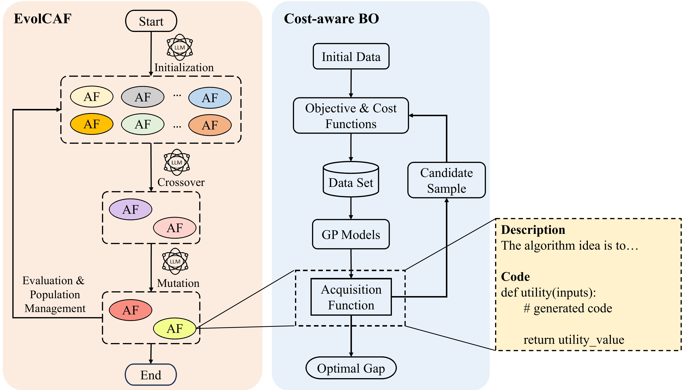

#### EvolCAF



EvolCAF is a novel framework that integrates large language models (LLMs) with evolutionary computation (EC) to automatically design acquisition functions (AFs) to enhance cost-aware Bayesian optimization (BO). 

Leveraging the crossover and mutation in the algorithm space, EvolCAF offers a novel design paradigm, significantly reduces the reliance on domain expertise and model training. The designed cost-aware AF maximizes the utilization of available information from historical data, surrogate models and budget details. It introduces novel ideas not previously explored in the existing literature on acquisition function design, allowing for clear interpretations to provide insights into its behavior and decision-making process.


#### Requirements

- [EoH](https://github.com/FeiLiu36/EoH)
- [BoTorch](https://github.com/pytorch/botorch)==0.9.2

#### Quick Start
+ Install [EoH](https://github.com/FeiLiu36/EoH)
+ Python runEoH.py

#### Cite the work

EvolCAF was introduced in

```
@article{yao2024evolve,
  title={Evolve Cost-aware Acquisition Functions Using Large Language Models},
  author={Yao, Yiming and Liu, Fei and Cheng, Ji and Zhang, Qingfu},
  journal={International Conference on Parallel Problem Solving From Nature (PPSN)},
  year={2024}
}
```

EoH was introduced in

```
@inproceedings{liu2024evolution,
  title={Evolution of Heuristics: Towards Efficient Automatic Algorithm Design Using Large Language Model},
  author={Liu, Fei and Tong, Xialiang and Yuan, Mingxuan and Lin, Xi and Luo, Fu and Wang, Zhenkun and Lu, Zhichao and Zhang, Qingfu},
  booktitle={Proceedings of International Conference on Machine Learning},
  year={2024}
}
```
